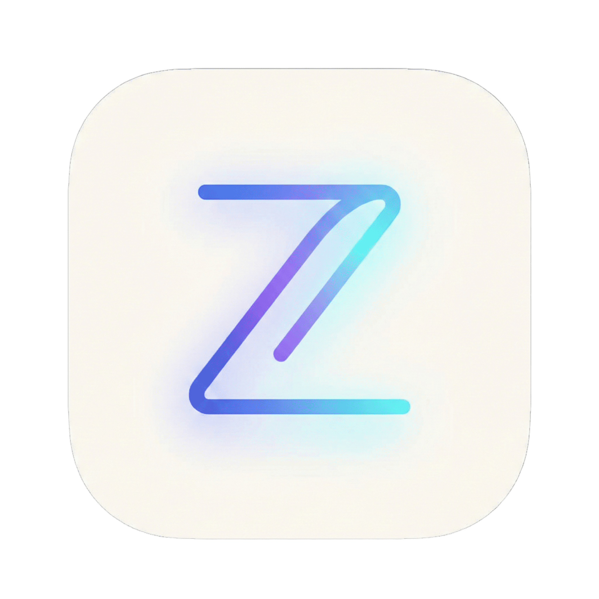

# 🌌 ZENITH - Gamified Life Operating System

> **"Turn your life into a game. Build habits, track fitness, and ship projects."**

**Zenith** is a comprehensive, personal **Life Operating System** built with the latest web technologies. It replaces scattered productivity apps with a single, cohesive "Mission Control" center. Designed with a **Cyberpunk/Dark aesthetic**, it combines fitness tracking, project management, and knowledge archiving into a cohesive RPG-style experience.

## ✨ Key Features

### 🎮 Gamification Engine
- **XP & Leveling System:** Earn XP for every completed task, workout, or reading session.
- **Soulslike Streaks:** A dynamic streak system with visual states ("Ignited" 🔥 / "Faded" 💀).
- **Badges & Achievements:** Unlock visual badges for consistency and milestones.
- **Celebrations:** Immersive visual and sound effects upon leveling up or completing milestones.

### 🏋️ Fitness Hub (Bio-Metrics)
- **Workout Planner:** Create custom splits, routines, and rest days.
- **Active Mode:** Live workout player with rest timers, progress tracking, and Spotify integration.
- **History & Heatmap:** Track volume, frequency, and consistency over time.

### 🚀 Mission Control (Projects & Tasks)
- **Milestones System:** Break down big goals into tracked steps with XP rewards.
- **Project Tracking:** Manage coding projects from idea to "Shipped".
- **Task Center:** Daily, Weekly, and Monthly quests with automated rollover.

### 📚 Knowledge Base (Second Brain)
- **Library:** Track books, reading progress, and page counts.
- **Courses Academy:** Manage online courses and certifications.
- **Media Deck:** Track games, movies, and manga.

### 🌍 Localization & UI
- **Bilingual Support:** Full support for **Arabic (RTL)** and **English (LTR)** with instant switching.
- **High-Performance UI:** Built with **Tailwind CSS** and **Framer Motion** for smooth animations.
- **Responsive Design:** Fully optimized for Desktop and Mobile usage.

---

## 🛠️ Tech Stack

| Category | Technology |
| :--- | :--- |
| **Framework** | [Next.js 14](https://nextjs.org/) (App Router) |
| **Language** | [TypeScript](https://www.typescriptlang.org/) |
| **Database** | [MongoDB Atlas](https://www.mongodb.com/) (Mongoose ODM) |
| **Styling** | [Tailwind CSS](https://tailwindcss.com/) |
| **Animations** | [Framer Motion](https://www.framer.com/motion/) |
| **Icons** | [Lucide React](https://lucide.dev/) |
| **Auth** | [NextAuth.js](https://next-auth.js.org/) |
| **Validation** | [Zod](https://zod.dev/) |
| **Sound** | [use-sound](https://github.com/joshwcomeau/use-sound) |

---

## 🚀 Getting Started

Follow these steps to run the project locally:

### 1. Clone the repository

git clone [https://github.com/YOUR_USERNAME/zenith-os.git](https://github.com/YOUR_USERNAME/zenith-os.git)
cd zenith-os
2. Install dependencies
Bash
npm install
3. Environment Setup
Create a .env file in the root directory and add the following variables:

مقتطف الرمز
# Database
MONGODB_URI=your_mongodb_connection_string_here

# NextAuth Configuration
NEXTAUTH_URL=http://localhost:3000
NEXTAUTH_SECRET=generate_a_random_secret_string_here

# Optional: Google Auth (If implemented)
GOOGLE_CLIENT_ID=your_google_id
GOOGLE_CLIENT_SECRET=your_google_secret
4. Run the development server

npm run dev
Open http://localhost:3000 with your browser to see the result.